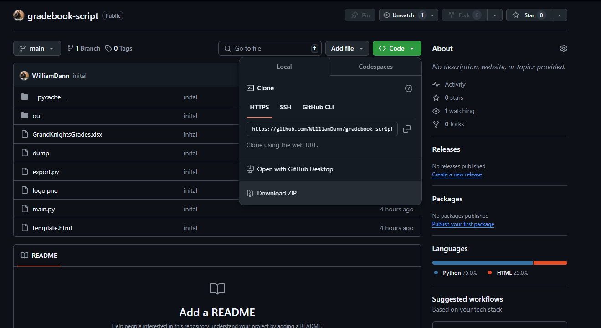

# Grand Knights Gradebook Script


Hello! This is a short explanation on how to use the Grand Knights Gradebook script to generate report cards from our gradebook file. These report card files can be sent to parents to update them on their student's progress

## Setup


### Download the Script
First we need to get the script installed. You can do this by downloading the script from it's GitHub repo here:

https://github.com/WilliamDann/gradebook-script

To download all the needed files, click the green Code button and download the ZIP archive of the repo:



This will give you a zip archive of the project that you will then need to extract. Here a the steps to follow:

1. Determine where you want the script to be stored in your file system
2. Right click on the downloaded ZIP file.
3. Select Extract All to unzip the file into a normal directory
4. Specify where you want to extract to. This is where the script will be stored.

### Install Python (if missing)
Install python here:
https://www.python.org/downloads/

The default settings should be fine.

### Install dependencies
Navigate to the directory where you extracted the script until you see a file called main.py. Right click on the background of the and select "Open Terminal". 

Run the following commands:
```
python -m pip install pandas xhtml2pdf numpy xlrd openpyxl
```

This installs the python dependencies for the project.

If you are getting an error about like "python is not a command" please follow this video:
https://www.youtube.com/watch?v=oa7YR5GpJ0A

This will add python to the environment path so that your computer can find it when you enter the python command. **You will need to restart the terminal for this change to take place**

### Setup Finished
You are now finished setting up the project

## Usage
To run the script:

1. Download the Excel file for the gradebook. This is done by File>Download>Microsoft Excel (xlsx).
2. Move the gradebook file into the same directory as the script (the script is main.py)
3. run the following command:
   
```
python main.py
```

This will ask you to enter the file name. Enter the full name of the file. **This includes the file extension, which is .xlsx**. The extension should be at the end of the file name.

If you entered a valid file, it should then ask you which sheet you're aiming to export. It will give you a number for each option, enter the number that corresponds to the class you're trying to export:

For example, if you wanted to export Class 3, it would look like this:
```
0 - Class 1
1 - Class 2
2 - Class 3

> 2
```

This will then leave .pdf files with the student's name in the out folder

4. Send the pdf files from the out folder. The pdfs are titled with the student's names


## Questions
If you have questions please email me at wcdann2@gmail.com. Thanks!